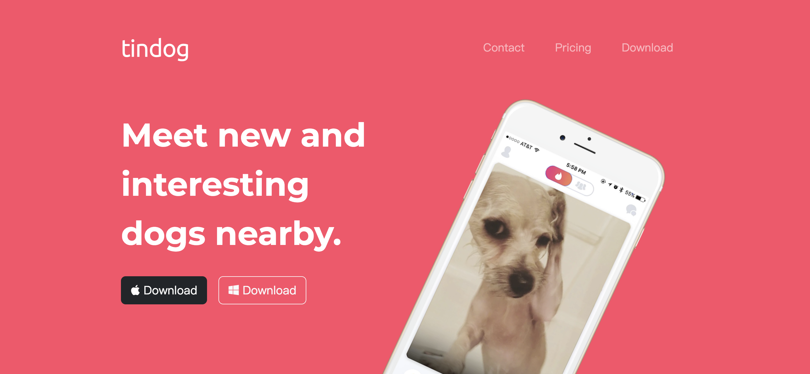
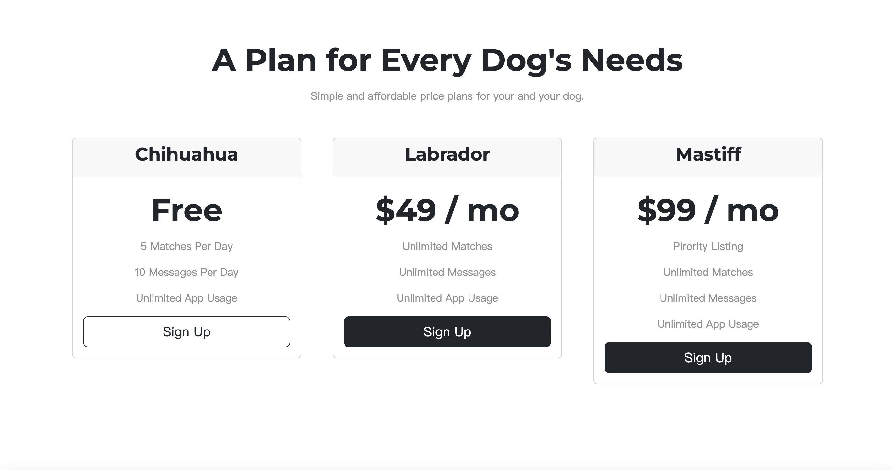
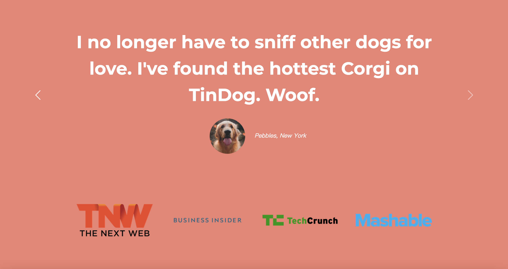
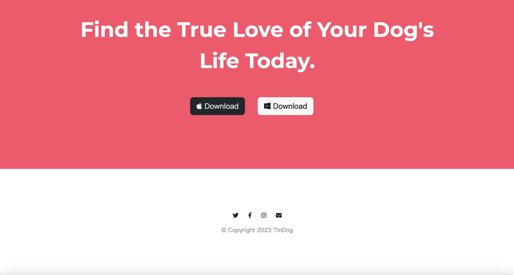

# TinDog
A similar tinder website for dogs. The original code is from Udemy Web Design class.

# About TinDog
The whole website contains different sections, including Title, Features, Testimonials, Press, Pricing, Download and Footer.   This tiny project realized a home page website which provides details of an application for finding dog partner.

# Tools
For TinDog only realized its frontend appearance, it is mainly built with HTML5, CSS3 and Bootstrap5.  The version of Bootstrap used in Angela Yu's course is a little bit falling behind, need to pay attention to the new documentations of Carousel, Grid, Button in Bootstrap5, or it may cause errors.

# Screenshots

# To be improved
* Even though we consider the display effect on mobile device, the display effect on the larger screen could be improved in the future or in other projects.
* Backend functions.